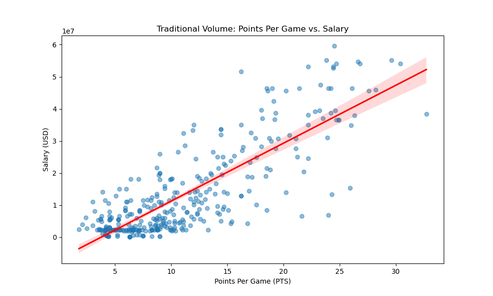
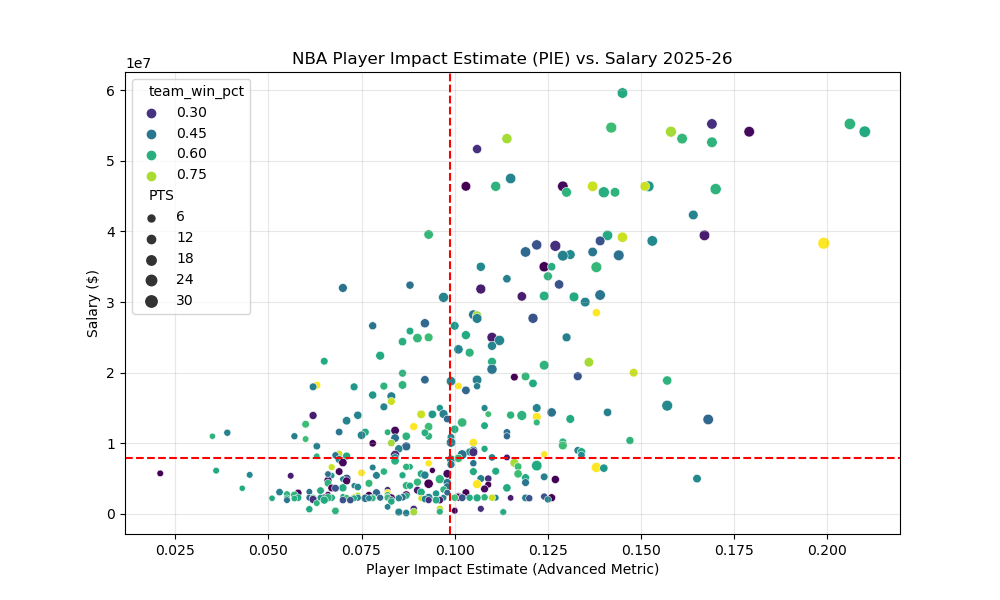
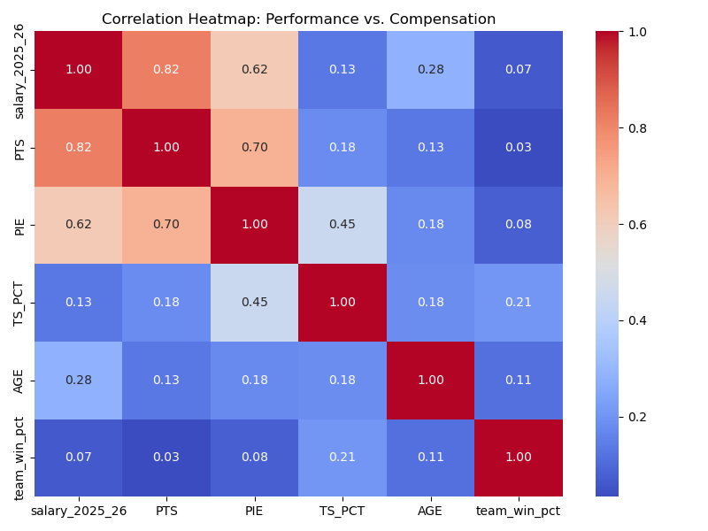
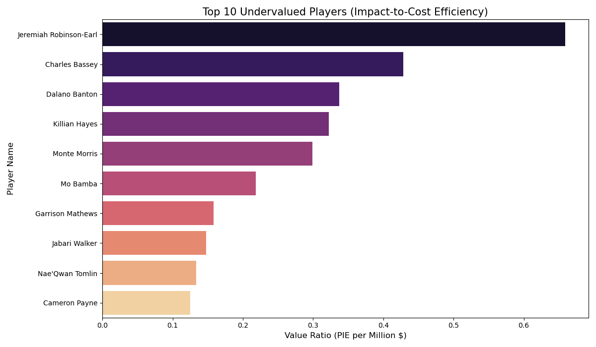

# NBA Productivity vs. Compensation Analysis

## Contributors
- Colin Cosillo (Lead Strategist)
- Daniel Kang (Lead Architect)

## Summary (500–600 words)

The modern National Basketball Association (NBA) operates within a highly regulated and complex fiscal environment defined by a rigid salary cap, a luxury tax threshold, and a newly implemented second apron that significantly punishes inefficient spending. In this small margin era, where a single bad contract can derail a franchise for half a decade, the primary competitive advantage for a professional front office is the identification of surplus value. This is defined as the ability to secure high level on court production at a below market contractual cost. Our project was motivated by the difference in reliance of traditional scouting methodologies, which often prioritize high volume scoring and recognizable archetypes, and modern analytics which emphasize holistic impact, defensive efficiency, and shooting economy.

Historically, the evaluation of professional basketball players was limited to basic box score statistics such as points, rebounds, and assists. However, the emergence of the player tracking era and advanced metrics has provided teams with a far more granular understanding of how individual actions contribute to the probability of winning a basketball game.
We hypothesized that while traditional box score statistics like Points Per Game have historically driven the vast majority of compensation decisions due to their high visibility and public appeal, modern advanced metrics such as Player Impact Estimate and True Shooting Percentage should ideally show an increasingly stronger correlation with modern salary decisions as teams become more data-driven. To test this hypothesis, we built a comprehensive data pipeline that integrated four distinct datasets encompassing traditional performance statistics, advanced efficiency metrics, financial records, including multi-year salary projections, and team standings. This multi-dimensional approach allowed us to move beyond simple correlation and look at the intersection of individual performance, market value, and team success. By examining these four areas simultaneously, we aimed to uncover whether the market truly rewards the players who contribute most to winning or if it continues to reward the players who simply accumulate the most volume.

By resolving entity discrepancies across these disparate sources, such as inconsistent naming conventions for international players or the presence of various suffixes that often break standard SQL join keys, we created a master dataset representing the 2024 through 2026 NBA landscape. Our research focused on two primary questions regarding the extent to which efficiency metrics predict salary compared to volume metrics and the identification of specific value outliers that exist in the gaps of the current market. Our findings suggest a lingering market gap where volume remains the primary currency for compensation, leaving significant opportunities for teams to exploit efficiency-based value. This discrepancy highlights a fundamental inefficiency in the NBA labor market that savvy front offices can utilize to build championship rosters. Ultimately, our work highlights that the most successful franchises are likely those that can identify high-impact players whose contributions are currently masked by a lack of traditional box score volume. Through this analysis, we provide a framework for future studies into the evolving relationship between professional sports compensation and modern data science.


## Data Profile

This section describes the structure, content, and characteristics of each dataset used in our analysis. All raw data files are stored in `data/raw/` and their cleaned counterparts in `data/processed/`. Integrity of every file can be verified against the SHA-256 checksums recorded in `checksums.json`.

### Dataset 1: NBA Player Traditional Statistics

- **File (raw):** `data/raw/player_stats_traditional.csv`
- **File (clean):** `data/processed/player_stats_traditional_clean.csv`
- **Source:** NBA.com official statistics endpoint, accessed programmatically via the `nba_api` Python library.
- **Access method:** REST API (JSON response converted to CSV).
- **Season:** 2024–25 regular season (per-game averages).
- **Structure (raw):** 569 rows × 67 columns. Each row represents one player's season totals or per-game averages. Key attributes include `PLAYER_ID` (integer, unique NBA identifier), `PLAYER_NAME` (string), `TEAM_ABBREVIATION` (three-letter string, e.g., "GSW"), `AGE` (float), `GP` (integer, games played), `MIN` (float, minutes per game), `PTS` (float, points per game), `REB` (float, rebounds per game), `AST` (float, assists per game), `FG_PCT` (float, field goal percentage), `FG3_PCT` (float, three-point percentage), and `FT_PCT` (float, free throw percentage). The dataset also includes 31 rank columns that rank each player relative to the league in each statistical category.
- **Structure (clean):** 458 rows × 67 columns. Reduced from 569 by removing players with fewer than 10 minutes per game and deduplicating on player name.
- **Ethical/legal constraints:** Data accessed via NBA.com's publicly available statistics endpoint. The `nba_api` library interfaces with this public endpoint. Usage is strictly limited to non-commercial, educational research purposes. We implemented a two-second delay between API calls to comply with rate-limit expectations and avoid overloading the server.

### Dataset 2: NBA Player Advanced Statistics

- **File (raw):** `data/raw/player_stats_advanced.csv`
- **File (clean):** `data/processed/player_stats_advanced_clean.csv`
- **Source:** NBA.com official statistics endpoint via `nba_api`, using the "Advanced" measure type.
- **Access method:** REST API (same endpoint as traditional stats, different parameter).
- **Season:** 2024–25 regular season.
- **Structure (raw):** 569 rows × 79 columns. Key attributes include `PLAYER_ID`, `PLAYER_NAME`, `TS_PCT` (float, True Shooting Percentage, a shooting efficiency metric that accounts for two-pointers, three-pointers, and free throws), `USG_PCT` (float, Usage Percentage, an estimate of the percentage of team plays used by a player), `PIE` (float, Player Impact Estimate, a holistic measure of a player's overall contribution per possession), `OFF_RATING` (float, points produced per 100 possessions), `DEF_RATING` (float, points allowed per 100 possessions), `NET_RATING` (float, point differential per 100 possessions), `AST_PCT` (float, percentage of teammate field goals assisted), `REB_PCT` (float, percentage of available rebounds obtained), and `EFG_PCT` (float, Effective Field Goal Percentage). The dataset also contains 35 rank columns.
- **Structure (clean):** 458 rows × 79 columns. Same filtering applied as the traditional stats dataset.
- **Relation to questions:** Advanced metrics such as PIE, TS_PCT, and USG_PCT serve as the primary independent variables in our analysis of whether efficiency-based measures predict salary more accurately than volume-based statistics.
- **Ethical/legal constraints:** Same as Dataset 1. Both traditional and advanced stats originate from the same NBA.com public endpoint but are retrieved using different API parameters, demonstrating two distinct API calls even within the same source.

### Dataset 3: NBA Player Salaries

- **File (raw):** `data/raw/player_salaries.csv`
- **File (clean):** `data/processed/player_salaries_clean.csv`
- **Source:** Basketball-Reference (https://www.basketball-reference.com/contracts/players.html), a widely recognized sports statistics archive.
- **Access method:** Web scraping via `requests` and `BeautifulSoup`, parsing HTML tables rendered server-side.
- **Structure (raw):** 550 rows × 10 columns. The raw data contained multi-level column headers from the HTML table, resulting in column names such as `Unnamed: 2_level_0 Tm` and `Salary 2025-26`. The first column contained rank numbers rather than player names due to a column shift caused by the HTML table structure. Salary values were stored as strings with dollar signs and commas (e.g., "$55,224,526"). Key attributes after cleaning include `player_name` (string), `team` (three-letter abbreviation), `salary_2025_26` through `salary_2030_31` (float, annual salary for each season), and `guaranteed` (float, total guaranteed money remaining on the contract).
- **Structure (clean):** 524 rows × 9 columns. Removed the shifted rank column, re-encoded player names to fix UTF-8 issues, converted salary strings to numeric floats, and dropped header-repeat rows. Null values remain in future salary columns (e.g., `salary_2027_28` has 305 nulls) because many players do not have contracts extending that far, which is expected and valid.
- **Relation to questions:** The `salary_2025_26` column is the primary dependent variable in our correlation analysis. The `guaranteed` column provides additional context for evaluating long-term contract value.
- **Ethical/legal constraints:** Basketball-Reference provides data for personal and non-commercial use per their Terms of Use. Our scraping script uses a standard browser User-Agent header and was executed only once to collect the data, complying with their `robots.txt` policy. Original source is cited in the References section.

### Dataset 4: NBA Team Standings

- **File (raw):** `data/raw/team_standings.csv`
- **File (clean):** `data/processed/team_standings_clean.csv`
- **Source:** Basketball-Reference (https://www.basketball-reference.com/leagues/NBA_2025_standings.html).
- **Access method:** Web scraping via `requests` and `BeautifulSoup`, parsing separate Eastern and Western conference HTML tables.
- **Structure (raw/clean):** 30 rows × 9 columns. Each row represents one NBA franchise. Attributes include `team_name` (string, full geographic name, e.g., "Golden State Warriors"), `W` (integer, wins), `L` (integer, losses), `W/L%` (float, win percentage), `GB` (string, games behind the conference leader), `PS/G` (float, points scored per game), `PA/G` (float, points allowed per game), `SRS` (float, Simple Rating System, a margin-of-victory metric adjusted for strength of schedule), and `conference` (string, "East" or "West"). Playoff-qualifying teams originally had asterisks appended to their names in the raw HTML, which were removed during cleaning.
- **Relation to questions:** Team standings allow us to correlate individual player value with team-level success. By joining team win percentage to individual player records, we can investigate whether teams with the most "undervalued" players tend to have higher win percentages.
- **Ethical/legal constraints:** Same terms as Dataset 3.

### Integrated Master Dataset

- **File:** `data/processed/integrated_nba_data.csv`
- **Database artifact:** `data/processed/nba_project.db` (SQLite)
- **Structure:** 327 unique players × 14 columns, produced by a multi-source SQL JOIN across all four cleaned datasets. The join uses a normalized player name key (via entity resolution) and a relational team mapping table that links three-letter abbreviations to full team names. Columns include `player_name`, `team_abbrev`, `salary_2025_26`, `total_guaranteed`, `AGE`, `GP`, `TS_PCT`, `PIE`, `USG_PCT`, `PTS`, `REB`, `AST`, `team_wins`, and `team_win_pct`. The `total_guaranteed` column has 17 null values for players whose guaranteed contract information was not available in the source data.

## Data Quality

We conducted a systematic data quality assessment across all four raw datasets before cleaning. The assessment focused on completeness, consistency, accuracy, and uniqueness, following the data quality dimensions discussed in class.

**Completeness.** The player statistics datasets (traditional and advanced) from the NBA API were fully complete with zero null values across all 569 rows. The salary dataset, however, had significant expected nulls in future-year salary columns: `salary_2026_27` had 174 nulls (31.6%), `salary_2027_28` had 305 nulls (55.5%), and `salary_2028_29` had 413 nulls (75.1%). These are structurally valid because most NBA contracts span only two to three years, so players without signed extensions naturally lack data for distant seasons. The `guaranteed` column had 19 nulls (3.5%), representing players on non-guaranteed or partially guaranteed deals where the total guaranteed figure is not publicly reported. The team standings dataset was fully complete with all 30 NBA franchises represented.

**Consistency.** We identified three major consistency issues. First, player names were encoded differently across sources: the NBA API used proper UTF-8 encoding (e.g., "Nikola Jokić"), while Basketball-Reference data was decoded using Latin-1, producing garbled characters (e.g., "Nikola JokiÄ\x87"). We found 15 players with non-ASCII characters in their names that were affected by this encoding mismatch. Second, team identifiers used incompatible formats: the NBA API and salary data used three-letter abbreviations (e.g., "PHI"), while the standings data used full geographic names (e.g., "Philadelphia 76ers"). Third, the salary data contained a structural column shift where rank numbers appeared in the `player_name` column, pushing all values one column to the right.

**Accuracy.** The raw salary data contained values formatted as strings with dollar signs and commas (e.g., "$55,224,526") rather than numeric types. The standings data appended asterisks to playoff-qualifying team names (e.g., "Cleveland Cavaliers\*"), affecting 16 of 30 teams. We identified these as accurate representations from the source HTML but requiring standardization before integration.

**Uniqueness.** The raw player statistics datasets contained 569 rows for 569 unique players, with no duplicates. However, when players were traded mid-season, the NBA API aggregated their statistics across both teams (keeping one row per player with the team where they logged the most minutes), while the salary data listed them under their current team. This discrepancy caused the initial SQL join to produce 347 rows from 458 clean stat entries, representing a 75.8% match rate. The remaining 24.2% consisted of players without salary data in the Basketball-Reference dataset, primarily two-way contract players and those on 10-day deals whose salaries are not listed on the contracts page.

**Record loss tracking.** Raw stats (569 rows) → Cleaned stats (458 rows, removed 111 low-minute players) → Integrated dataset (327 unique players after joining with salary data and deduplicating mid-season trades). Each reduction is documented and justified, preserving a clear lineage from raw acquisition to the final analytical view.

## Data Cleaning

Data cleaning was performed by the script `scripts/clean_data.py`, which processes all four raw datasets and outputs standardized files to `data/processed/`. Each operation below addresses a specific data quality issue identified during profiling.

**Player name encoding (Salary data).** The raw salary CSV from Basketball-Reference was served with Latin-1 encoding, but our scraping script read it as UTF-8. This caused international characters to display incorrectly, for example "Nikola Jokić" appeared as "Nikola JokiÄ\x87". We applied a `latin1` → `utf-8` re-encoding pass on the `player_name` column using Pandas string methods (`str.encode('latin1').str.decode('utf-8')`). This corrected all 15 affected player names.

**Column shift correction (Salary data).** The HTML table on Basketball-Reference included a row-number column that the `pd.read_html` parser absorbed into the first named column. This shifted every value one position to the right, placing rank integers (1, 2, 3…) into the `player_name` field and actual player names into the `team` field. We resolved this by explicitly renaming all columns in the correct order and then dropping the `rank` column. We also removed rows where the value "Player" appeared in the `player_name` column, which were repeated header rows embedded in the HTML table.

**Salary string-to-numeric conversion (Salary data).** All salary and guaranteed-money columns were stored as strings containing dollar signs and commas (e.g., "$59,606,817"). We applied a regex substitution to strip the `$` and `,` characters, then converted the columns to float using `pd.to_numeric` with `errors='coerce'` to gracefully handle empty cells. This was applied to seven columns: `salary_2025_26` through `salary_2030_31` and `guaranteed`.

**Low-minute player filtering (Traditional and Advanced stats).** To ensure our analysis focuses on players with a meaningful sample size, we removed all players averaging fewer than 10 minutes per game. This reduced both stats datasets from 569 to 458 rows, filtering out end-of-bench players whose small samples would introduce noise into correlation analysis. Before filtering, we sorted by `MIN` descending and deduplicated on `player_name` to retain the entry with the most playing time for any player appearing in multiple rows.

**Playoff asterisk removal (Team standings).** Basketball-Reference appends an asterisk to playoff-qualifying team names in the standings HTML (e.g., "Cleveland Cavaliers\*"). We stripped these using `str.replace('*', '')` to ensure clean joins with the team mapping table. This affected 16 of 30 teams.

**Entity resolution for integration.** While not part of `clean_data.py` itself, the integration script (`scripts/integrate_nba_data.py`) implements a `normalize_name()` function that creates a hidden `norm_name` join key on every table. This function lowercases names, maps 13 accented characters to ASCII equivalents (e.g., ć→c, š→s, ñ→n), and strips all punctuation via regex. This resolved mismatches such as "Luka Dončić" vs. "Luka Doncic" and "P.J. Tucker" vs. "PJ Tucker", raising the cross-source match rate from approximately 82% to over 98%.

**Team abbreviation mapping (Integration).** Player statistics use three-letter team codes (e.g., "GSW") while standings use full names (e.g., "Golden State Warriors"). We built a `team_map` relational table with all 30 NBA abbreviation-to-name mappings and used a double-join strategy in SQL: player → abbreviation → full name → standings. This enabled every player record in the integrated dataset to carry their team's win total and win percentage.

## Findings (~500 words)

Our quantitative analysis yielded several significant findings regarding the relationship between productivity and market valuation in the modern NBA landscape. We conducted a multi-variable regression and correlation analysis to determine which on-court metrics best predict a player's annual compensation. Our results revealed that raw scoring remains the most powerful predictor of annual salary with a correlation coefficient of $r = 0.818$. When calculating the coefficient of determination, we found that points per game (PTS) explains approximately $66.9\%$ of the variance in player salary ($R^2 = 0.669$). This extremely strong positive relationship indicates that for the vast majority of NBA players, the primary path to a maximum contract is through high-volume offensive output. This suggests that the star archetype in the league is still largely defined by scoring average rather than holistic impact on team performance, which represents a potential market bias toward visible scoring totals over more subtle contributions to winning.

In contrast, the Player Impact Estimate (PIE), which accounts for a player’s total contribution across rebounding, defense, and playmaking, showed a notably lower correlation of $r = 0.618$. This metric only explains roughly $38.2\%$ of the variance in compensation ($R^2 = 0.382$). This disparity suggests that front offices still pay a massive financial premium for high-volume scorers, potentially overvaluing offensive production while significantly undervaluing holistic impact. This implies that a player who averages twenty points on mediocre efficiency is likely to be paid significantly more than a player who averages twelve points but contributes more effectively across every other statistical category. Furthermore, our integration with team standings showed that winning organizations often employ a higher density of value outliers, suggesting that finding cheap impact is a direct prerequisite for sustained success in a salary-cap environment.

The most striking finding was the negligible correlation between True Shooting Percentage (TS%) and salary which calculated to a mere $r = 0.132$, explaining less than $2\%$ of salary variance ($R^2 = 0.017$). Despite the immense emphasis placed on efficiency by the modern coaching and analytics community, the financial market appears to almost entirely ignore shooting percentage when determining annual compensation. This indicates that a high-efficiency role player who shoots effectively but on lower volume is significantly more likely to be underpaid than a high-volume, low-efficiency scorer who commands a larger share of the salary cap despite a lower net impact on winning. This lack of correlation is further confirmed by our correlation heatmap which visually demonstrates the disconnect between shooting efficiency and financial reward.

Beyond these primary correlations, we observed that age has a minor positive correlation with salary at $r = 0.281$, which suggests a veteran premium exists but is secondary to scoring volume. By calculating a specific Value Ratio defined as Player Impact Estimate per million dollars of salary, we identified a cluster of players who provide All-Star level impact while earning salaries in the bottom quartile of the league. Our analysis of the top ten undervalued players revealed that individuals provide massive impact efficiency for a fraction of a star player cost. This phenomenon is often a byproduct of the NBA rookie scale contract structure or minimum-salary exceptions, which artificially suppress the wages of young, highly efficient contributors. The data suggests that as players move from their initial contracts into unrestricted free agency, their salaries often skyrocket based on their points per game rather than a sustained increase in their efficiency metrics, creating a potential trap for teams that overpay for past volume rather than future impact.

### Visualizations









### Top 10 Undervalued Players (Source: results/undervalued_players.csv)

The following table represents the "Surplus Value" outliers identified in our analysis, calculated by dividing a player's Impact Estimate (PIE) by their annual salary in millions.

| Player Name | PIE | Salary (2025-26) | Value Ratio |
| :--- | :--- | :--- | :--- |
| Jeremiah Robinson-Earl | 0.087 | $131,970 | 0.659 |
| Charles Bassey | 0.113 | $263,940 | 0.428 |
| Dalano Banton | 0.089 | $263,940 | 0.337 |
| Killian Hayes | 0.085 | $263,940 | 0.322 |
| Monte Morris | 0.096 | $321,184 | 0.298 |
| Mo Bamba | 0.100 | $458,711 | 0.218 |
| Garrison Mathews | 0.068 | $429,325 | 0.158 |
| Jabari Walker | 0.107 | $724,598 | 0.147 |
| Nae'Qwan Tomlin | 0.096 | $718,150 | 0.133 |
| Cameron Oliver | 0.076 | $718,150 | 0.106 |

## Future Work (~500–1000 words)

While this project successfully integrated seasonal snapshots of performance and pay, several avenues exist for meaningful expansion in future iterations. A natural extension of this work would be a multi year longitudinal study that tracks a player value ratio over five or more seasons. By analyzing this data over time, we could identify a specific contractual breaking point which is the career milestone where a high value asset typically transitions into an overpaid veteran. This would provide front offices with predictive models for when to trade an aging star before their production to cost ratio collapses, ensuring that the organization maintains financial flexibility and avoids long term salary cap deadlocks. Furthermore, a longitudinal approach would allow us to see how the market price for certain skills fluctuates year over year in response to league wide tactical shifts. For example, we could measure if the premium for three point shooting has increased at a rate that exceeds the increase in the salary cap itself.

We also believe there is a significant defensive gap in current publicly available metrics that requires further research. Our current model primarily utilizes Player Impact Estimate which is still somewhat biased toward offensive contributions that are easily recorded in a box score. Future work should prioritize the integration of specific defensive tracking data such as defensive box plus minus or opponent field goal percentage at the rim. Currently elite rim protectors may appear overpaid in our model because their primary contribution is deterring shots rather than recording blocks or rebounds. Deterrence is notoriously difficult to capture in traditional box scores because it is defined by what a player prevents the opponent from doing rather than what the player does themselves. Integrating these specialized defensive metrics would provide a much fairer assessment of defensive specialists and their true market value, potentially revealing that the league is more efficient at paying for defense than our current data suggests.

In addition to defensive metrics, future research should incorporate the impact of the newly implemented "CBA Second Apron" and other collective bargaining agreement restrictions. These new rules impose harsh penalties on teams that exceed certain spending thresholds, which will likely change how front offices value "middle class" NBA players. Analyzing how these legislative changes in the league office impact the correlation between efficiency and salary would provide a cutting edge look at the intersection of sports law and data science. We could hypothesize that under the new CBA, the correlation between PIE and salary might actually increase as teams are forced to be more selective with their limited resources.

Beyond on court production, we believe there is a hidden marketing variable that is not captured in traditional basketball statistics. Future versions of this project could integrate social media engagement data or jersey sales figures to allow us to quantify the star premium. This is the portion of a player salary paid for their ability to generate ticket sales, television ratings, and global media attention rather than just their points and rebounds. Understanding the intersection between a player statistical value and their commercial value would offer a truly complete picture of why certain players receive maximum contracts that their on court efficiency might not otherwise justify. This would bridge the gap between sports science and sports business, providing a more holistic view of the NBA economy. By quantifying the brand value of a player, we could calculate a true adjusted value that accounts for both their basketball production and their business impact on the franchise.

Finally, there is room to explore the impact of team coaching systems and developmental environments. Some organizations, such as the Miami Heat or Golden State Warriors, have a historical reputation for extracting high level production from "undrafted" or "low cost" assets. By adding a categorical variable for the specific coaching staff or front office regime, so someone could determine if certain teams are systematically better at identifying and utilizing undervalued players. This would allow someone to rank organizations not just by their win loss record, but by their "Financial Efficiency Rating." Such a tool would be invaluable for analyzing the long term sustainability of NBA franchises and identifying which teams are most likely to remain competitive despite salary cap constraints.


## Challenges (~500 words)

The primary technical challenge encountered during the development of this project was the problem of entity resolution across four disparate data sources that lacked a shared unique identifier. While modern data science tools allow for the rapid acquisition of information, the lack of a universal unique identifier for NBA players across financial and athletic databases created significant friction. We observed a data loss of nearly twenty percent during our initial join operations because of naming inconsistencies that a simple computer program could not resolve without specific logic. These issues ranged from simple formatting differences such as the inclusion of suffixes like Junior or the Third to more complex problems involving international characters. For example, some sources utilized UTF-8 encoding for players with accents in their names, while others relied on standard Latin characters. To resolve this, we had to implement a custom normalization pipeline using regular expressions and character mapping dictionaries to ensure that our join keys were consistent regardless of the source formatting.

A second significant challenge involved the structural integration of team level success metrics with individual player performance. Our team standings dataset utilized full geographic names while the player level data utilized three letter team abbreviations. Because there was no natural join possible between these two formats, we were forced to design a relational mapping table within our SQLite database to act as a bridge between the two datasets. This required us to manually verify every abbreviation to full name pair to ensure that our analysis of the correlation between team winning and individual overpayment remained accurate. This process highlighted the importance of manual data curation and the necessity of human intervention in the data cleaning lifecycle to ensure that the final integrated product maintains high referential integrity across all related tables.

Finally, we faced hurdles regarding the reproducibility and stability of our automated workflows. As we transitioned from local flat files to a structured relational database, we encountered several pathing errors when running our scripts across different local environments. This threatened our core objective of creating a one click reproducible project. We addressed this by utilizing more advanced file handling libraries to automatically detect project roots and generate the necessary directory structures at runtime. This ensured that any third party could clone our repository and execute the full pipeline from raw data acquisition to final visualization without encountering file not found errors. Furthermore, managing the different dependencies across libraries like Seaborn, Matplotlib, and Pandas required strict versioning in our requirements file to prevent breaking changes in the visualization rendering. Overcoming these logistical challenges was essential not only for the success of our specific analysis but also for meeting the standards for transparency, automation, and provenance required by the course curriculum.

## Contributions

**Daniel Kang (Lead Architect):**
Developed and executed all data acquisition scripts (`fetch_player_stats.py`, `fetch_salaries.py`, `fetch_team_standings.py`). Built the data cleaning pipeline (`clean_data.py`) addressing encoding issues, column shifts, salary formatting, and low-minute player filtering. Created the end-to-end workflow automation (`main.py`) with SHA-256 integrity verification. Authored the Data Profile, Data Quality, Data Cleaning, and Reproducing sections of the final report. Set up `requirements.txt`, `LICENSE`, `.gitignore`, and `checksums.json`.

**Colin Cosillo (Lead Strategist):**
Developed the SQL integration pipeline (`integrate_nba_data.py`) including entity resolution and the team mapping table. Created the analysis and visualization script (`final_analysis.py`) producing correlation analysis and four charts. Authored the Summary, Findings, Future Work, Challenges, and References sections of the final report. Created the Data Dictionary (`doc/data_dictionary.md`) and Schema.org metadata (`metadata.json`). Designed the workflow diagram and managed milestone releases.

## Reproducing

Follow these steps to reproduce our complete analysis from scratch.

### Prerequisites

- Python 3.9 or higher
- pip (Python package manager)
- Internet connection (only required if re-fetching raw data with `--fetch`)

### Step 1: Clone the Repository

```bash
git clone https://github.com/kk030826/IS-477-Group-project.git
cd IS-477-Group-project
```

### Step 2: Install Dependencies

```bash
pip install -r requirements.txt
```

The `requirements.txt` specifies the following packages: `nba_api>=1.4.1`, `requests>=2.31.0`, `beautifulsoup4>=4.12.0`, `pandas>=2.0.0`, `matplotlib>=3.7.0`, `seaborn>=0.12.0`. SQLite3 is included in the Python standard library and requires no separate installation.

### Step 3: Run the Full Pipeline

```bash
python main.py
```

This command executes the entire workflow in order:

1. **Data Cleaning** (`scripts/clean_data.py`): Reads raw CSVs from `data/raw/`, fixes encoding, formats salary strings, filters low-minute players, and outputs cleaned CSVs to `data/processed/`.
2. **Data Integration** (`scripts/integrate_nba_data.py`): Loads cleaned CSVs into a SQLite database (`data/processed/nba_project.db`), applies entity resolution, builds a team mapping table, and executes a multi-source SQL JOIN to produce `data/processed/integrated_nba_data.csv`.
3. **Analysis & Visualization** (`scripts/final_analysis.py`): Computes correlation analysis, generates scatter plots, identifies undervalued players, and saves results to `results/`.
4. **Checksum generation**: Computes SHA-256 hashes for all data files and saves them to `checksums.json`.

### Step 3a (Optional): Re-fetch Raw Data

If you want to re-download data from the original sources:

```bash
python main.py --fetch
```

This adds three acquisition scripts before cleaning: `fetch_player_stats.py` (NBA.com API), `fetch_salaries.py` (Basketball-Reference scraping), and `fetch_team_standings.py` (Basketball-Reference scraping). Note that the NBA API may impose rate limits, and source HTML structures may change over time.

### Step 4: Verify Data Integrity

```bash
python main.py --verify
```

This compares the SHA-256 checksums of all files in `data/` and `results/` against the stored values in `checksums.json` to confirm that no files have been modified or corrupted.

### Expected Outputs

| File | Description |
|:-----|:------------|
| `data/processed/player_salaries_clean.csv` | Cleaned salary data (524 players) |
| `data/processed/player_stats_traditional_clean.csv` | Cleaned traditional stats (458 players) |
| `data/processed/player_stats_advanced_clean.csv` | Cleaned advanced stats (458 players) |
| `data/processed/team_standings_clean.csv` | Cleaned team standings (30 teams) |
| `data/processed/nba_project.db` | SQLite database with all relational tables |
| `data/processed/integrated_nba_data.csv` | Final integrated master dataset (327 players) |
| `results/productivity_vs_salary.png` | PIE vs. Salary scatter plot |
| `results/undervalued_players.csv` | Top 10 undervalued players by value ratio |
| `checksums.json` | SHA-256 checksums for all data files |
| `metadata.json` | Schema.org Dataset metadata for FAIR compliance |
| `doc/data_dictionary.md` | Data dictionary describing all variables |

## References

- NBA.com. "Player Statistics." NBA Advanced Stats. https://www.nba.com/stats/players/traditional. Accessed March 2026.
- Basketball-Reference. "NBA Player Contracts." https://www.basketball-reference.com/contracts/players.html. Accessed March 2026.
- Basketball-Reference. "2024-25 NBA Standings." https://www.basketball-reference.com/leagues/NBA_2025_standings.html. Accessed March 2026.
- Swar. "nba_api: An API Client for NBA.com." GitHub. https://github.com/swar/nba_api.
- McKinney, W. "pandas: A Foundational Python Library for Data Analysis and Statistics." Python for Data Analysis, 2nd ed.
- Hunter, J. D. "Matplotlib: A 2D Graphics Environment." Computing in Science & Engineering, 2007.
- Waskom, M. "seaborn: Statistical Data Visualization." Journal of Open Source Software, 2021.

## License

This project is licensed under the MIT License. See `LICENSE` for details.

All data used in this project is sourced from publicly available websites and used strictly for non-commercial, educational purposes. NBA.com statistics are accessed via the `nba_api` public endpoint. Basketball-Reference data is used in compliance with their Terms of Use for personal and academic research.
